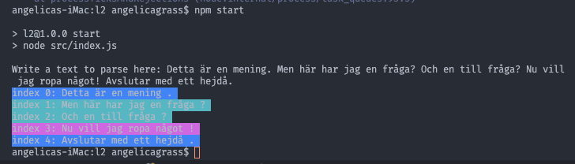

### Hur används parsern

Länk till github: [angelicas parser](https://github.com/angelicagrass/parser) 


Skriv npm start. Sedan skriver du in texten som ska parseas med avslutande valfritt tecken: ' . ? ! '

I index.js finns ett exempel på hur parsern kan användas.  
Först skapas själva tokenizer som används som ett npm paket till denna parsern. Regex reglerna ligger i grammar modulen.

````
const TheTokenizer = new Tokenizer(regex, text)
const sentences = TheTokenizer.tokenizeTheString()
````
Klassen Dokument innehåller en rad methoder för att kunna hämta ut olika typer av meningar:
- getExclamationSentences()
- getRegularSenteneces()  
- getQuestionSentences()  

För att kalla på dessa skriver man in tex document.getRegularSentences(), det finns ett utkommenterat exempel på detta i index.js om man vill testa.

````
const parser = new Parser(sentences).parse()
const document = new Document(parser)
````

Här nedan skapas prettyPrinter och vi kallar på funktionen colorize som skriver ut meningarna i färg beroende på vilken sort de tillhör.
````
const printer = new PrettyPrinter(document)
printer.colorize()
````

    

