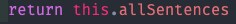
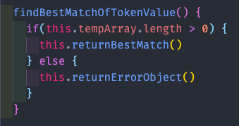
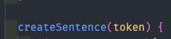
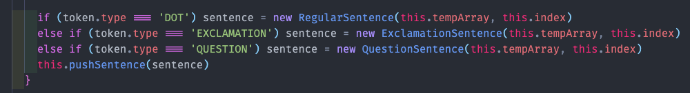
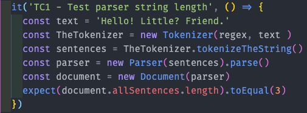
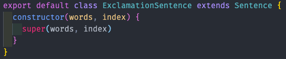
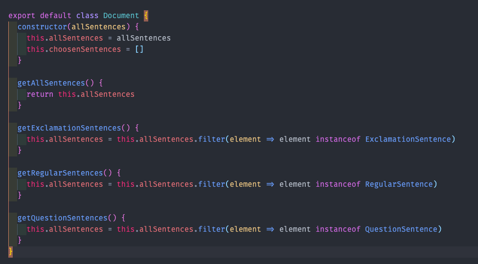

# Mall för inlämning laboration 1, 1dv610

## Checklista
  - [ ] Jag har skrivit all kod och reflektioner själv. Jag har inte använt mig av andras kod för att lösa uppgiften.
  - [ ] Mina testresultat är skrivna utifrån utförd testning ( och inte teoretiskt, "det bör fungera" :) )
  - [ ] De enda statiska metoder eller funktioner utanför klasser som jag har är för att starta upp min testapplikation ex main(java).
  - [ ] De enda bibliotek och färdiga klasser som används är sådana som måste användas (eller som används för att testa modulen).

## Egenskattning och mål
  - [ ] Jag är inte klar eftersom jag vet att jag saknar något. Då skall du inte lämna in!
  - [ ] Jag eftersträvar med denna inlämning godkänt betyg (E-D)
    - [ ] De flesta testfall fungerar (enstaka testfall kan misslyckas, tydligt vilka)
    - [ ] Koden är förberedd på återanvändning
    - [ ] All kod samt historik finns i git 
    - [ ] Reflektionerna är skrivna
    - [ ] Koden är läsbar
  - [ ] Jag eftersträvar med denna inlämning högre betyg (C) och anser mig uppfylla alla extra krav för detta. 
    - [ ] Jag är noga i min testning
    - [ ] En del av testfallen är automatiserade (Tokenizer/Parser/PP), viss del kan vara manuellt testad.
    - [ ] Det finns en tydlig beskrivning i hur mina moduler skall användas. 
    - [ ] Mina reflektioner visar tydligt att jag förstått bokens koncept.
  - [ ] Jag eftersträvar med denna inlämning högsta betyg (A-B) 
    - [ ] Sammanhängande reflektion som ger ett gott helhetsintryck och visar detaljerad förståelse för kodkvalitet.
    - [ ] Min kod är ... (pussar fingrar och gör smackljud)
    - [ ] Extrauppgift parser finns med som egen modul(er)

Förtydligande: Examinator kommer sätta betyg oberoende på vad ni anser. Att ha "saker" från högre betygsnivåer verkar positivt och kan väga upp brister i inlämningen.

## Komponenter och återanvändning
 * Länka in URL om du använder olika repositorier för dina olika komponenter. 
 * Beskriv komponenterna och hur de skall användas.
 * Beskriv hur du anpassat din kod och instruktioner för att någon annan programmerare skall kunna använda dina komponenter. Om du skrivit instruktioner för din användare länka till dessa. Om inte beskriv här hur någon skall göra. 
 * Beskriv hur du säkerhetställt att beroendena mellan komponenterna är som beskrivs i laborationen. 

## Beskrivning av min kod
Beskriv din kod på en hög abstraktionsnivå. En kort beskrivning av dina viktigaste klasser och metoder i dina komponenter. Skapa gärna ett klassdiagram som bild. Beskriv relationerna mellan klasserna mellan komponenter.

## Hur jag testat
Beskriv hur du kommit fram till om din kod fungerar. Beskriv de olika delarna och hur de testats. Screenshots från manuell testning.

### Testfall
Lista de enskilda testfallen, eller länka in detta.

| Namn      | Indata | Förväntat Utfall | PASS/FAIL |
| --------- | ------ | ---------------- | --------- |
|           |        |                  |           |

Screenshots från automatisk testning.

## Kapitelreflektioner för kapitel 2-11
Gå igenom all kod inklusive kod från laboration 1 och uppdatera enligt bokens clean code kapitel 2-11 och det vi diskuterat på föreläsningar och workshops. Skriv en kort (4-6 meningar) reflektion för varje kapitel om hur just det kapitlet har påverkat eller inte påverkat din kod. Använd bokens termer. Ge exempel med läsbara screenshots från er kod till varje reflektion.

<h3 style="color:pink">Kapitel 2 - Meaningful Names</h3>  

Jag tycker att jag under den här kursen verkligen har börjat tänka mig för vad det gäller namngivning och just tydligheten med vad variabeln innehåller. Detta har lett till att jag ej behöver dokumentera min kod på samma sätt som tidigare då destor mer jag arbetar på det här sättet tänker på så att namnen beskriver vad som sker eller vad just den variabeln innehåller. I boken tar de upp detta som **revealing names**. Jag har även tänkt på att använda **uttalbara namn** så att all namngivning är lätt att uttala och att alla är verkliga ord eller meningar. Jag försöker tänka på att min kod ska vara lätt att läsa för människor oavsett nivå. 

  

  
<h3 style="color:pink">Kapitel 3 - Functions</h3>  

Något jag gick tillbaka och arbetade med i min tokenizer var att bryta ut funktionalitet från if-satser och lägga dessa i egna metoder istället. Så inuti **if-satserna kallas det enbart på en funtion istället**. Jag har även kontinuerligt gått igenom min kod och försökt att hitta funtioner som går att plocka isär så att **funktionen endast gör en sak och den gör det bra** istället för att flera saker ska hända inuti samma funtion. Jag har också siktat på att lägga koden i **rätt ordning** så att det blir lättare att läsa koden uppifrån och ner.  

  
<h3 style="color:pink">Kapitel 4 - Comments</h3>  

Jag har inte använt mig av  några kommentarer alls då jag siktar helt på att använda mig av beskrivande namn på både funktioner och variabler. Enda gången jag lägger in en kommentar är för att påminna mig själv om något som behöver fixas vid ett senare tillfälle eller så, dessa tas dock bort innan koden lämnas in och är helt klar. Sådana kommentarer nämns som **TODO** i boken. Jag kan ofta även använda mig av **commented-out code** där jag kommenterar bort kod som ej används för tillfället. Dessa tas bort så snart jag är säker på att de inte kommer att behöva användas igen.
Just på funktioner är det extra viktigt att använda tydliga namn då detta faktiskt medför att man kan skippa tillexempel JSDOC helt, i boken hänvisar det till javadocs men det är ju i praktiken samma sak. 

  
<h3 style="color:pink">Kapitel 5 - Formatting</h3>  

  Just det här kapitlet kändes för mig ganska självklart redan innan. Jag tycker att det är snyggt och lättläst med luft mellan funktioner så det blir lättläst och tydligt. Jag tycker det är bra att gå tillbaka i sin kod och se vart det kan bli lite svårläst. **Conceptual affinity** har jag använt när functioner hör ihop och vill således ligga nära varandra för enklare läsbarhet. **Indentation** får vi ju en del på köpet när vi använder visual studio code och efter att ha använt skolan lintning i ett år så sitter det lite i ryggmärgen hur vi indenterar för att det ska bli enkelt och snyggt att läsa. Boken tar upp **Dummy scopes** där jag inte är beredd att hålla med. När jag personligen läser kod som enbart innenhåller ett utryck efter en if sats eller en while loop så blir det för mig mer lättlast om jag får dessa serverade på samma rad. Jag har även valt så att göra i min kod som du kan se i kodexemplet nedan. Detta är snabbt ändrat om det anses som fel men det är inget jag kommer sluta med om jag inte hamnar på ett företag såklart som har den kodstandarden då det som sagt i mina ögon blir mer lättläst på det här viset, men vi kanske alla läser lite olika. 

  
    
  
<h3 style="color:pink">Kapitel 6 - Objects and data structures</h3> 

Jag hade velat använda mig av privata metoder och attribut med hjälp av det nya sättet med # inom ES6 men har inte fått till tiden till att implementera det då jag även skull behöva lära mig hur just detta fungerar. Jag kan även se i mina tester att jag upptcäker problem med mina meningar då det blir krångligt att komma åt tex questionsentences då den hamnar i ett objekt som heter document.allSentences.

  
<h3 style="color:pink">Kapitel 7 - Error handling</h3> 

  
<h3 style="color:pink">Kapitel 8 - Boundaries</h3>   

Jag använder mig av min Tokenizer som skulle kunna ses som en tredjeparts mjukvara bara det att jag själv har gjort den och sedan lagt upp den på npm. Även readline är inget jag egentligen byggt själv utan den kommer via node så den tog det lite tid att lära sig genom att testa och diskutera med andra. 

  
<h3 style="color:pink">Kapitel 9 - Unit Test</h3> 

**Clean tests** tycker jag att jag har använt mig av, testerna är rena och testar en sak per test. Jag använder mig utav jest i testerna där det är lätt att dela upp och göra det läsbart enligt mig. Jag hade däremot velat se till att få ordning på min tokenizer och parser så att jag inte behöver ha så många functionsanrop för att byga ihop inför varje test. Jag har tex en .parse funktion som jag måste kalla på för när jag la denna i konstruktorn blev något helt galet och tiden för att felsöka fanns inte riktigt så det var bara att gilla läget för nu och bygga om när tid finnes.  

  
  
<h3 style="color:pink">Kapitel 10 - Classes</h3>   

Ett misstag som jag anser mig ha gjort i uppgiften och som jag kommer ta med mig är att **klasser bör vara små**. Jag gör ofta väldigt stora klasser som kan göra en mängd olika saker. I det här fallet lyckades jag iallafall med några klasser som ärvde från Sentences klassen. Dessa vart mycket små så de är jag nöjd med. En sidoeffekt av mina stora klasser är att dessa får ett stort ansvar med flera variabler i konstruktorn.

  

Klass Document i parser.

  
<h3 style="color:pink">Kapitel 11 - Systems</h3> 

  **Scaling up**, jag har byggt ut min parser steg för steg och laggt till funktionalitet allt efterssom. Precis som boken nämner att man inte bygger en hel stad på en gång. Detta kan man även se i git-historiken att saker och ting har byggt var för sig och stegvis. Något jag skulle kunna tänka mer på är att det inte är nödvändigt att göra en **Big DesignUp Front** just för att det kan hämma förmågan att hantera förändringar. Kanske behöver jag inte veta hur jag har tänkt att bygga hela systemet utan anpassa mig mer efter resans gång. Jag hade även velat separera min "main" som i detta fallet heter index.js genom att använda mig av en fasad som bygger upp hela parsern med document, tokenizer osv. i index.js hade isåfall det enbart legat en kod som kallade på fasaden för att dra igång systemet så hade man kunnat gömma ännu mer av komplexiteten.

<h2 style="color:pink">Laborationsreflektion</h2> 
  
Jag tycker det som genomsyrat hela kursen är just att tänka till när man skriver kod. Att inte bara tänka att det ska fungera utan att det ska vara lättläst och enkelt att sätta sig in i. När man sedan får chansen att komma ut i arbetslivet så tror jag att just detta kommer vara väldigt viktigt att ta med sig. Det kommer vara många människor som ska kunna förstå just min kod och mina kommentarer. Att bryta isär koden är något jag ser fram emot att bara lära mig mer om så att jag blir bättre på just den delen. Jag känner själv att jag alldels för ofta skriver för stora klasser med alldels för mycket ansvar och skulle behöva bryta ner dessa till mindre klasser. Jag har där ofta svårt att se hur jag ska gå tillväga, att bryta ut en klass från en befintlig klass och få detta att fungera. Jag vill även ge lite beröm till själva boken som jag tycker har varit både lätt att förstå och intressant att läsa, den får mig att tänka till och stanna upp när jag skriver min kod.  
Tycker även att det här med code review var väldigt lärorikt och att tänka till hur andra känner när man i princip kritiserar deras kod. Det finns många bra sätt att prata med varandra när det kommer till förbättringar och allt går att säga på "ett snällt sätt". Jag har även lärt mig att det inte är "läskigt" att låta andra gå in och peta i koden utan ser det mer som ett tillfälle att få ta del av andras kunskap och suga åt mig av de råd och tips som finns där.  
En annan del som verkligen har utvecklats i min kod är min namngivning, jag la ganska stort fokus på att ha korta namn innan kursen men har under den här resan börjat känna mig riktigt bekväm med att ta i när det kommer till längden på namn så det blir klart och tydligt vad både varibaler innehåller och vad funktioner gör.

